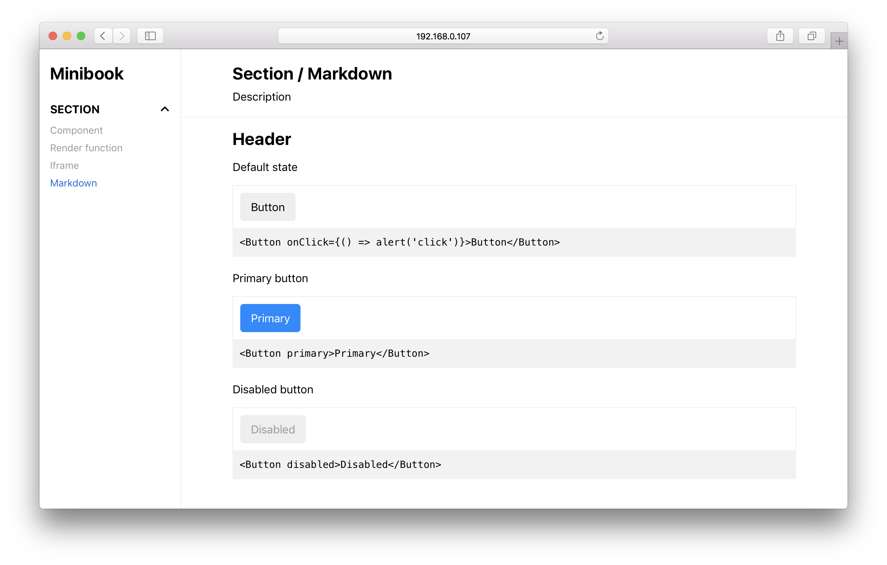

# :orange_book: Minibook

Minibook is a minimalistic interface for documentation and examples of components.



## Install

```
npm install minibook minibook-loader
```

## Example

```js
import MiniBook from 'minibook'
import 'minibook/lib/styles.css'

import MarkdownStory from './markdown.md'

const sections = {
    section: {
        name: 'Section name',
        component: SomeComponent,
        stories: {
            'props-story': {
                name: 'Component',
                description: 'Story that displays React component with some props',
                props: { /* props for the component */ }
            },

            'render-story': {
                name: 'Render function',
                description: 'Custom render function for a story',
                props: { /* props for the component */ },
                render: (Component, props) => <Component {...props} />
            },

            'iframe-story': {
                name: 'Iframe',
                description: 'Page displayed in the iframe',
                src: '/page.html'
            },

            // Markdown with embedded components examples
            'markdown-story': MarkdownStory
        }
    }
}

// You should set 'height: 100%' to html, body, and container element
ReactDOM.render(
    <MiniBook title="Minibook" sections={sections} />,
    document.querySelector('#root')
)
```

## Markdown Stories

`minibook-loader` compiles markdown to React JSX.

At the top of the markdown document you can add YAML section 
with name and description attributes of the story and 
list of imported modules for examples.

```
---
name: 'Markdown'
description: 'Description'
imports:
  'Button': './Button.js'
---
```

You can use following blocks in markdown documents:

### Table of contents

Auto-generated table of contents from headers in the document.

````md
```@toc
```
````

You can change headers level, and list type:

````md
```@toc
levels: [1, 2, 3]
loose: true
ordered: true
```
````

### Render and example

- Blocks with `@render` tag allows to render React components.
- Block with `@example` tag outputs the rendered component followed
by the source code.


````md
```@render
<Button onClick={() => alert('click')}>Button</Button>
```

```@example
<Button onClick={() => alert('click')}>Button</Button>
```
````

### File source

Include source code of the file.
You can set tab width and lines range. 

````md
```@source
file: ./Button.js
tabs: 4
from: 4
to: 27
```
````

### Props docs

Documentation for component's props generated with
[react-docgen](https://github.com/reactjs/react-docgen).
You can even use markdown in props description.

````md
```@propsdoc
file: ./Button.js
allowMarkdown: true
```
````

```js
// Button.js
Button.propTypes = {
    /** Some description. */
    number: PropTypes.number
}
```

## Setup

To be able to load markdown stories with webpack, you need to use
`minimark-loader` in combination with `babel-loader` for `*.md` files:

```js
{
    test: /\.md$/,
    use: [
        {
            loader: 'babel-loader',
            options: { /* options for babel-loader */ }
        },
        {
            loader: 'minimark-loader',
            options: require('minibook/minimark-preset')
        }
    ]
}
```

You can view full config example at
[packages/example/webpack.config.js](https://github.com/sunflowerdeath/minibook/blob/master/packages/minibook-example/webpack.config.js)

## Props

### title
Type: `string`

### sections
Type: `array<Section>`

Section – object with the following properties:

- name `string` – Section name
- stories `object<Story>` – Stories of the section, an object where keys are
URLs of the stories and values are stories
- component `Component` – React component that will be displayed in stories

Story – object with the following properties:

- name `string` – Story name
- description `string` – Story description
- props `object` – Props for the section's component
- render `(Component, props) => node` – Custom render function
- src `string` – URL of the page to be displayed in the iframe

## License

This software is released into the public domain. See the LICENSE file.
